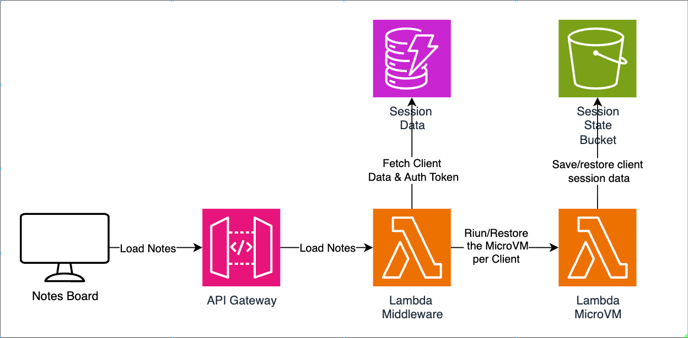

# Lambda MicroVM Sticky Notes Board

A demo of **Lambda MicroVM state persistence**: a Sticky Notes Board where you
add notes and upload files in a MicroVM, the MicroVM gets terminated, and when a
new one starts for the same user — everything is still there.

It also shows a practical pattern around MicroVMs: a small **session middleware**
(Lambda + DynamoDB behind API Gateway) that reconnects a returning user to their
running MicroVM, or launches a fresh one that restores their last session from S3.

## What you get

- A **web UI** (`web/`) with notes and files **side by side**: create/edit/delete
  sticky notes, upload/download any file, and edit text files in the browser.
- A **session middleware** (`middleware/`) that the browser talks to exclusively —
  it owns the MicroVM lifecycle and auth tokens, so the browser never holds AWS
  credentials or the MicroVM endpoint.
- The **MicroVM app** (`microvm/`) itself: a notes + files REST API plus the
  lifecycle hooks that persist state to S3.

## Architecture



The browser only ever talks to the API Gateway origin. Everything under `/api/*`
is reverse-proxied to the client's MicroVM by the middleware, which injects the
`X-aws-proxy-auth` token server-side. This keeps the token off the client and
sidesteps the MicroVM endpoint's lack of browser-usable CORS.

| Component | Port | Purpose |
|-----------|------|---------|
| Web UI (`web/`) | — | Static browser app (notes + files, two-pane) |
| Session middleware (`middleware/`) | — | API Gateway + Lambda + DynamoDB; session lifecycle, auth tokens, `/api` reverse proxy |
| Hooks server (`microvm/app/hooks_server.py`) | 9000 | MicroVM lifecycle hooks (`/ready`, `/run`, `/resume`, `/suspend`, `/terminate`) |
| Notes + Files API (`microvm/app/main_app.py`) | 8080 | Notes CRUD + any-file upload/download + text-file editing |

### Where state lives

- **Notes** accumulate in MicroVM memory; **uploaded files** live in the MicroVM's
  local filesystem (`/tmp/microvm-files`). Both are ephemeral while it runs.
- State is persisted to S3 **only at lifecycle boundaries**: the `/suspend` and
  `/terminate` hooks push notes (`microvm-state/<clientId>/board.json`) and files
  (`microvm-files/<clientId>/*`) to S3; the `/run` hook restores both on boot.
- **Client isolation:** the `clientId` becomes the S3 key prefix, so one client can
  never see another's notes or files.
- The middleware never touches notes or files — it only tracks the *session* (which
  MicroVM, which token) in DynamoDB so a returning user reconnects or relaunches.

## Prerequisites

- AWS credentials configured for the target account (admin or equivalent for the
  one-command deploy, which creates IAM roles, a bucket, a MicroVM image, DynamoDB,
  Lambda, and API Gateway).
- Access to **Lambda MicroVMs** in your region.
- The AWS CLI, plus `python3` + `pip`, `zip`, and `jq` on your PATH.

## Deploy (one command)

```bash
./deploy.sh
```

`deploy.sh` is a thin bootstrap; everything else is a CloudFormation stack
(`template.yaml`). The script:

1. Creates the S3 state/staging bucket (CLI — it must exist *before* the stack,
   because the MicroVM image's `CodeArtifact.Uri` points at the staged artifact).
2. Packages and uploads two artifacts: the `microvm/` folder (the image artifact)
   and the middleware Lambda zip (its code + a current boto3 + the vendored
   `lambda-microvms` SDK model).
3. Runs `aws cloudformation deploy template.yaml`, which creates the MicroVM
   image, the build + execution IAM roles, the DynamoDB session table, the
   middleware Lambda, and the API Gateway HTTP API.
4. Prints the stack outputs — including the **Middleware URL** for the web UI.

Re-running `./deploy.sh` re-stages the artifacts and updates the stack in place.
The middleware zip is uploaded under a content-hashed key, so a code change is
picked up as a Lambda update.

Configuration is via environment variables (all optional):

| Variable | Default | Purpose |
|----------|---------|---------|
| `AWS_REGION` | `us-east-1` | Target region |
| `STACK_NAME` | `sticky-notes-demo` | CloudFormation stack name + resource label |
| `STATE_BUCKET` | `<STACK_NAME>-state-<accountId>` | S3 bucket for staging + notes/files |
| `API_STAGE` | `prod` | API Gateway stage |

```bash
AWS_REGION=us-east-1 STACK_NAME=my-notes ./deploy.sh
```

## Run the web UI

The UI is static — no build step:

```bash
cd web
python3 -m http.server 5173
# open http://localhost:5173
```

Then:

1. Paste the **Middleware URL** (the API Gateway URL from `deploy.sh`, e.g.
   `https://abc123.execute-api.us-east-1.amazonaws.com/prod`).
2. Enter a **Client ID** (e.g. `demo-user-ricardo`). The same ID always restores the
   same notes and files. Both values are remembered in `localStorage`.
3. Click **Open my workspace**. The top bar shows your Client ID and the launched
   **MicroVM ID**, plus a pill for whether the session was reused, restored, or new.

In the workspace, Notes (left) and Files (right) sit side by side:

- **Notes** — click any note to edit its content, color, and position; create and delete.
- **Files** — upload any file (button or drag-and-drop), download, or delete. Text
  files get an **Edit** button that opens an in-browser editor and saves back.

## Verifying persistence

1. Add a few notes and upload a file.
2. In the UI, **Switch workspace** (or let the MicroVM idle out) — state flushes to S3.
3. Open the workspace again with the **same Client ID** — the MicroVM relaunches and
   the `/run` hook restores your notes and files. The top-bar pill reads
   "restored from S3".

## API reference

### Session middleware (API Gateway)

| Method | Path | Purpose |
|--------|------|---------|
| `POST` | `/session` | Open/reconnect a session. Body `{clientId}`. Returns `{microvmId, restored, reused, ...}` |
| `POST` | `/session/token` | Mint a fresh auth token for the current MicroVM |
| `POST` | `/session/close` | Mark the UI closed (keeps the record for next restore) |
| `DELETE` | `/session` | Terminate the MicroVM (state flushes to S3) |
| ANY | `/api/{proxy+}` | Reverse-proxy to the client's MicroVM; clientId via `X-Client-Id` header |

### MicroVM app (reached through the `/api` proxy)

| Method | Path | Purpose |
|--------|------|---------|
| `GET` | `/notes` | List notes |
| `POST` | `/notes` | Create a note — `{content, color?, position_x?, position_y?}` |
| `PUT` | `/notes/{id}` | Edit a note |
| `DELETE` | `/notes/{id}` | Delete a note |
| `GET` | `/files` | List files |
| `POST` | `/files` | Upload any file — raw body, filename in `X-File-Name` |
| `GET` | `/files/{name}` | Download a file |
| `DELETE` | `/files/{name}` | Delete a file |
| `GET` | `/files/{name}/text` | Get a text file's contents (`415` if not text) |
| `PUT` | `/files/{name}/text` | Edit a text file — `{content}` |

> File transfers go through API Gateway, which caps payloads at ~10 MB, so uploads
> via the UI are limited to ~9 MB.

## Project structure

```
.
├── deploy.sh                 # Bootstrap: bucket + stage artifacts + deploy stack
├── template.yaml             # CloudFormation: image, IAM, DynamoDB, Lambda, API GW
├── microvm/                  # ── MicroVM image artifact (zipped as-is) ──
│   ├── Dockerfile            # Container image
│   ├── requirements.txt      # App deps (boto3)
│   ├── entrypoint.py         # Starts hooks server (9000) + app server (8080)
│   └── app/                  # Application package
│       ├── hooks_server.py   # Lifecycle hooks; syncs files to/from S3
│       ├── main_app.py       # Notes + Files REST API (CORS enabled)
│       ├── notes_board.py    # In-memory board model (create/edit/delete)
│       ├── file_store.py     # Local-FS file store + S3 sync at lifecycle
│       └── state_store.py    # S3 save/load for the notes board
├── middleware/               # ── Session middleware (Lambda) ──
│   ├── handler.py            # API Gateway entrypoint: session routes + /api proxy
│   ├── session_store.py      # DynamoDB session records (keyed by clientId)
│   ├── microvm_control.py    # lambda-microvms control-plane wrapper
│   └── botocore_models/      # Vendored lambda-microvms SDK model
└── web/                      # ── Browser UI (static) ──
    ├── index.html
    ├── styles.css
    └── app.js
```

## Implementation notes

- **Infrastructure:** `template.yaml` defines the MicroVM image
  (`AWS::Lambda::MicrovmImage`), both IAM roles, the DynamoDB table, the middleware
  Lambda, and the API Gateway HTTP API. The middleware Lambda's IAM policy lives in
  that template (the `MiddlewareRole` resource).
- **`lambda-microvms` SDK:** this service isn't in the boto3 bundled with the Lambda
  runtime. The middleware bundles a current boto3/botocore plus the vendored service
  model (`middleware/botocore_models/`), registered via `AWS_DATA_PATH`. Its IAM
  actions authorize under the `lambda:` prefix (e.g. `lambda:RunMicrovm`) and it needs
  `lambda:PassNetworkConnector` for the ingress/egress connectors.
- **Snapshot hooks:** `/ready` lets the platform snapshot the fully-booted app;
  `/run`, `/suspend`, `/terminate` drive state restore/persist.
- **CORS:** the browser only calls the API Gateway origin; its CORS config allows the
  `X-Client-Id` and `X-File-Name` headers and the `PUT` method the UI needs.

## Cleanup

First terminate any MicroVMs still running (they're created at runtime, not by the
stack, so CloudFormation won't remove them). Then delete the stack and the bucket:

```bash
export AWS_REGION=us-east-1
export STACK_NAME=sticky-notes-demo
export STATE_BUCKET=${STACK_NAME}-state-$(aws sts get-caller-identity --query Account --output text)

# Terminate any running MicroVMs for this image (list, then terminate each):
aws lambda-microvms list-microvms --region "$AWS_REGION" \
  --query "microvms[].microvmId" --output text | tr '\t' '\n' | while read -r id; do
    [ -n "$id" ] && aws lambda-microvms terminate-microvm --microvm-identifier "$id" --region "$AWS_REGION"
  done

# Delete the CloudFormation stack (image, IAM roles, DynamoDB, Lambda, API Gateway):
aws cloudformation delete-stack --stack-name "$STACK_NAME" --region "$AWS_REGION"
aws cloudformation wait stack-delete-complete --stack-name "$STACK_NAME" --region "$AWS_REGION"

# Empty and remove the S3 bucket (not managed by the stack):
aws s3 rb "s3://$STATE_BUCKET" --force
```
